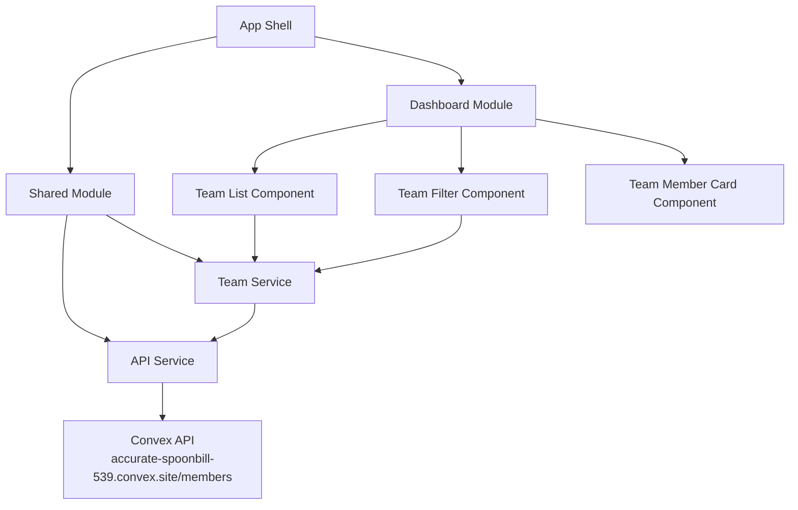

# Design Document

## Overview

The Angular Team Dashboard is a modern, responsive single-page application built with Angular that displays team member information with filtering capabilities. The application follows Angular best practices including standalone components, lazy loading, reactive programming with RxJS, and testing.

## Architecture

### High-Level Architecture



### Module Structure

- **App Module**: Root module with routing configuration
- **Dashboard Module**: Feature module (lazy-loaded) containing team dashboard functionality
- **Shared Module**: Common services, pipes, and utilities

### Component Hierarchy

```
AppComponent
├── HeaderComponent (navigation/title)
├── RouterOutlet
    └── DashboardComponent (lazy-loaded)
        ├── TeamFilterComponent
        └── TeamListComponent
            └── TeamMemberCardComponent (repeated)
```

## Components and Interfaces

### Core Components

#### 1. AppComponent
- **Purpose**: Root component providing application shell
- **Responsibilities**: 
  - Main navigation/header
  - Router outlet for lazy-loaded modules
- **Template**: Basic layout with header and router-outlet

#### 2. DashboardComponent
- **Purpose**: Main dashboard container
- **Responsibilities**:
  - Coordinate between filter and list components
  - Manage loading states
  - Handle responsive layout
- **State Management**: Uses RxJS observables for team data and filters

#### 3. TeamFilterComponent
- **Purpose**: Filtering controls for team members
- **Responsibilities**:
  - Role filter dropdown
  - Status filter dropdown
  - Clear filters functionality
- **Inputs**: Available roles and statuses
- **Outputs**: Filter change events

#### 4. TeamListComponent
- **Purpose**: Display filtered team members
- **Responsibilities**:
  - Render team member cards
  - Handle responsive grid/list layout
  - Show loading and empty states
- **Inputs**: Filtered team members array

#### 5. TeamMemberCardComponent
- **Purpose**: Individual team member display
- **Responsibilities**:
  - Display member information (name, role, status, performance)
  - Responsive card design
  - Accessibility features
- **Inputs**: TeamMember object

### Services

#### 1. TeamService
- **Purpose**: Business logic and state management
- **Responsibilities**:
  - Fetch team data from API
  - Manage filtering logic
  - Provide observables for components
  - Handle loading states
- **Methods**:
  - `getTeamMembers(): Observable<TeamMember[]>`
  - `filterByRole(role: string): void`
  - `filterByStatus(status: string): void`
  - `clearFilters(): void`

#### 2. ApiService
- **Purpose**: Handle API communication with Convex backend
- **Responsibilities**:
  - Fetch team member data from https://accurate-spoonbill-539.convex.site/members
  - Handle HTTP errors and loading states
  - Transform API response to match application models
- **Methods**:
  - `getTeamMembers(): Observable<TeamMember[]>`
  - `getRoles(): Observable<string[]>` (derived from team data)
  - `getStatuses(): Observable<string[]>` (derived from team data)

## Data Models

### TeamMember Interface (Based on Convex API)
```typescript
interface TeamMember {
  id: number;
  name: string;
  email: string;
  role: string;
  status: string;
  performance_indicator: number;
  start_date: string;
  end_date: string;
  team_lead: string;
  vacation_taken: number;
}

// Transformed interface for UI
interface TeamMemberUI {
  id: number;
  name: string;
  email: string;
  role: string;
  status: string;
  performanceScore: number;
  startDate: Date;
  endDate: Date;
  teamLead: string;
  vacationTaken: number;
}
```

### Filter State Interface
```typescript
interface FilterState {
  role: string | null;
  status: string | null;
}
```

### Dashboard State Interface
```typescript
interface DashboardState {
  teamMembers: TeamMember[];
  filteredMembers: TeamMember[];
  filters: FilterState;
  loading: boolean;
  error: string | null;
}
```

## State Management with RxJS

### TeamService State Management
- Uses BehaviorSubjects for reactive state management
- Combines team data with filter state using RxJS operators
- Implements proper error handling and loading states

```typescript
// Key observables in TeamService
private teamMembersSubject = new BehaviorSubject<TeamMember[]>([]);
private filtersSubject = new BehaviorSubject<FilterState>({ role: null, status: null });
private loadingSubject = new BehaviorSubject<boolean>(false);

// Computed observable for filtered members
filteredMembers$ = combineLatest([
  this.teamMembersSubject.asObservable(),
  this.filtersSubject.asObservable()
]).pipe(
  map(([members, filters]) => this.applyFilters(members, filters))
);
```

## Responsive Design

### Breakpoints
- **Mobile**: < 768px (single column)
- **Tablet**: 768px - 1024px (2 columns)
- **Desktop**: > 1024px (3-4 columns)

### Layout Strategy
- **Primary**: Card-based grid layout using Tailwind CSS Grid
- **Optional**: Toggle between card and list view (if time permits)
- Responsive grid: 1 column (mobile) → 2 columns (tablet) → 3-4 columns (desktop)
- Tailwind utilities for responsive breakpoints and spacing

## Performance Considerations

### Lazy Loading
- Dashboard module lazy-loaded to reduce initial bundle size
- Route-based code splitting

### Change Detection
- OnPush change detection strategy for performance
- Immutable data patterns with RxJS

### Virtual Scrolling (Optional)
- If team size is large, implement Angular CDK virtual scrolling

## Error Handling

### API Error Handling
- Service-level error handling with proper user feedback
- Retry logic for failed requests
- Graceful degradation when API is unavailable

### User Experience
- Loading spinners during data fetch
- Empty state when no team members match filters
- Error messages with retry options

## Testing Strategy

### Unit Tests (Jasmine/Karma)
1. **TeamService Tests**:
   - Test filtering logic
   - Test API integration
   - Test error handling

2. **Component Tests**:
   - TeamFilterComponent filter emission
   - TeamMemberCardComponent data display

### End-to-End Tests (Cypress/Playwright)
1. **Dashboard Flow Test**:
   - Load dashboard
   - Apply filters
   - Verify filtered results
   - Clear filters and verify all results shown

### Testing Utilities
- Mock data factories for consistent test data
- Custom testing utilities for RxJS observables
- Page Object Model for E2E tests

## Accessibility Implementation

### WCAG Compliance
- Semantic HTML structure (main, section, article, header)
- ARIA labels for interactive elements
- Proper heading hierarchy (h1, h2, h3)
- Focus management for keyboard navigation

### Specific Features
- Skip links for keyboard users
- Screen reader announcements for filter changes
- High contrast support
- Keyboard navigation for all interactive elements

### Implementation Details
- `role="main"` for dashboard content
- `aria-label` for filter controls
- `aria-live` regions for dynamic content updates
- Focus indicators for all interactive elements

## Technology Stack

### Core Technologies
- **Angular 17+**: Latest stable version with standalone components
- **TypeScript**: Strict mode enabled
- **RxJS**: For reactive programming and state management
- **Tailwind CSS**: For utility-first styling and responsive design

### Development Tools
- **Angular CLI**: Project scaffolding and build tools
- **ESLint + Prettier**: Code quality and formatting
- **Jasmine/Karma**: Unit testing
- **Cypress or Playwright**: E2E testing

### Build and Deployment
- **Angular CLI build**: Production optimization
- **Source maps**: For debugging
- **Bundle analysis**: For performance monitoring